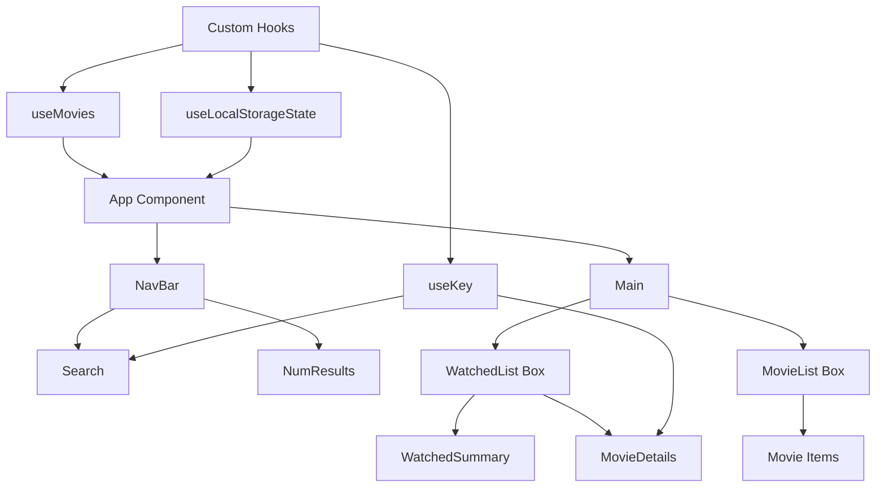

# 🍿 RateFlix - Movie Rating App

A React-based movie search and rating application that demonstrates advanced React concepts and custom hooks implementation.


## 🎯 Project Overview

**usePopcorn** is a movie search application where users can:
- 🔍 Search for movies using the OMDB API
- ⭐ Rate movies with a custom star rating component
- 📝 Maintain a personal watched movies list
- 💾 Persist data using localStorage
- ⚡ Handle loading states and error management


---
## 🌐 Preview

<p align="center">
  
  
</p>
---

---
Preview
## 🚀 Key Learning Outcomes

This project demonstrates mastery of several advanced React concepts:

### 🎣 Custom Hooks Implementation

| Hook | Purpose | Key Learning |
|------|---------|--------------|
| `useMovies` | Movie fetching & search | API integration, race condition handling |
| `useLocalStorageState` | Persistent state management | localStorage integration, lazy evaluation |
| `useKey` | Keyboard event handling | Global event listeners, cleanup |

### 🔄 React Hooks Mastery

#### `useEffect` Hook Applications
- **API Calls**: Fetching movie data with proper cleanup
- **Document Title Updates**: Dynamic page title changes
- **Event Listeners**: Global keyboard shortcuts
- **Cleanup Functions**: Preventing memory leaks

#### `useState` with Lazy Evaluation
```javascript
// ✅ Correct: Lazy evaluation for expensive initial state
const [watched, setWatched] = useLocalStorageState([], "watched");

// ❌ Wrong: Function called on every render
const [watched, setWatched] = useState(getFromLocalStorage());
```

---

## 🛠️ Technical Implementation Highlights

### 🏃‍♂️ Race Condition Management
- **Problem**: Multiple API calls could return out of order
- **Solution**: AbortController implementation in custom hooks
- **Benefit**: Prevents outdated responses from overwriting current data

### 💾 localStorage Integration
- **Smart Persistence**: Automatic save/load of watched movies
- **Race Condition Prevention**: Proper state synchronization
- **Error Handling**: Graceful fallback for localStorage failures

### ⌨️ Keyboard Navigation
- **Enter Key**: Focus search input and clear query
- **Escape Key**: Close movie details modal
- **Event Cleanup**: Proper removal of event listeners

---

## 📊 Project Architecture



---

## 🎨 Component Structure

### 🔧 Utility Components
- **Loader**: Loading state indicator
- **ErrorMessage**: User-friendly error display
- **Box**: Collapsible content container

### 🎬 Movie Components
- **MovieList**: Grid display of search results
- **Movie**: Individual movie card
- **MovieDetails**: Detailed view with rating system

### 📊 Statistics Components
- **WatchedSummary**: Analytics dashboard
- **WatchedMoviesList**: Personal movie collection

---

## 💡 Advanced Patterns Demonstrated

### 🎯 Conditional Rendering Strategy
```javascript
{isLoading && <Loader />}
{!isLoading && !error && <MovieList movies={movies} />}
{error && <ErrorMessage message={error} />}
```

### 🔄 State Management Best Practices
- **Lifting State Up**: Shared state management
- **Controlled Components**: Form input handling
- **State Synchronization**: localStorage integration

### 🧹 Cleanup & Memory Management
- **useEffect Cleanup**: Preventing memory leaks
- **AbortController**: Canceling pending requests
- **Event Listener Removal**: Proper event cleanup

---

## 🎪 Interactive Features

| Feature | Implementation | User Benefit |
|---------|----------------|--------------|
| 🔍 **Real-time Search** | Debounced API calls | Smooth search experience |
| ⭐ **Star Rating** | Custom interactive component | Intuitive rating system |
| 💾 **Data Persistence** | localStorage hooks | Remembers user preferences |
| ⌨️ **Keyboard Shortcuts** | Global event handling | Power user experience |
| 📱 **Responsive Design** | CSS Grid & Flexbox | Works on all devices |

---

## 🧠 Problem-Solving Highlights

### 🏁 Race Condition Solution
**Challenge**: API responses arriving out of order  
**Solution**: AbortController implementation  
**Impact**: Reliable data consistency

### 🔄 State Synchronization
**Challenge**: localStorage and React state sync  
**Solution**: Custom hook with lazy evaluation  
**Impact**: Seamless persistence without performance issues

### 🎯 User Experience Focus
**Challenge**: Loading states and error handling  
**Solution**: Comprehensive UI feedback system  
**Impact**: Professional, polished user experience

---

## 🚀 Getting Started

1. **Clone the repository**
2. **Install dependencies**: `npm install`
3. **Start development server**: `npm start`
4. **Search for movies** and start rating! 🎬

---

## 🎓 Skills Demonstrated

### ✅ React Fundamentals
- Component composition and reusability
- Props and state management
- Event handling and form controls

### ✅ Advanced React Patterns
- Custom hooks development
- Effect hook mastery
- Performance optimization techniques

### ✅ JavaScript Proficiency
- ES6+ features and destructuring
- Async/await and Promise handling
- Array methods and functional programming

### ✅ API Integration
- RESTful API consumption
- Error handling and loading states
- Request cancellation and cleanup

---

*Built with ❤️ as a learning project to master React hooks and modern development patterns*